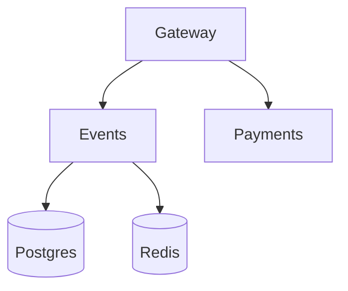

# Lab 1 Report — QuickTicket

## Introduction

In this lab I deployed the QuickTicket system, checked that it works, and then stopped different services one by one. The main goal was to see how failures affect the whole system and what the user sees when something is down.

## 1. Deployment Proof

After starting the system with Docker Compose, all five containers were running:

```text
NAME             IMAGE                COMMAND                  SERVICE    CREATED          STATUS                   PORTS
app-events-1     app-events           "uvicorn main:app --…"   events     43 seconds ago   Up 41 seconds            0.0.0.0:8081->8081/tcp, [::]:8081->8081/tcp
app-gateway-1    app-gateway          "uvicorn main:app --…"   gateway    42 seconds ago   Up 41 seconds            0.0.0.0:3080->8080/tcp, [::]:3080->8080/tcp
app-payments-1   app-payments         "uvicorn main:app --…"   payments   43 seconds ago   Up 10 seconds            0.0.0.0:8082->8082/tcp, [::]:8082->8082/tcp
app-postgres-1   postgres:17-alpine   "docker-entrypoint.s…"   postgres   5 minutes ago    Up 3 minutes (healthy)   0.0.0.0:5432->5432/tcp, [::]:5432->5432/tcp
app-redis-1      redis:7-alpine       "docker-entrypoint.s…"   redis      8 minutes ago    Up 3 minutes (healthy)   0.0.0.0:6379->6379/tcp, [::]:6379->6379/tcp
```

So the system started correctly with `gateway`, `events`, `payments`, `postgres`, and `redis`.

## 2. Main Flow Check

Before breaking anything, I tested the normal user flow.

### List events

```json
[
    {
        "id": 1,
        "name": "Go Conference 2026",
        "venue": "Main Hall A",
        "date": "2026-09-15T09:00:00+00:00",
        "total_tickets": 100,
        "price_cents": 5000,
        "available": 100
    },
    {
        "id": 4,
        "name": "Python Workshop",
        "venue": "Lab 301",
        "date": "2026-09-22T14:00:00+00:00",
        "total_tickets": 25,
        "price_cents": 2000,
        "available": 25
    },
    {
        "id": 2,
        "name": "SRE Meetup",
        "venue": "Room 204",
        "date": "2026-10-01T18:00:00+00:00",
        "total_tickets": 30,
        "price_cents": 0,
        "available": 30
    },
    {
        "id": 5,
        "name": "Kubernetes Deep Dive",
        "venue": "Auditorium B",
        "date": "2026-10-10T10:00:00+00:00",
        "total_tickets": 80,
        "price_cents": 8000,
        "available": 80
    },
    {
        "id": 3,
        "name": "Cloud Native Summit",
        "venue": "Expo Center",
        "date": "2026-11-20T10:00:00+00:00",
        "total_tickets": 500,
        "price_cents": 15000,
        "available": 500
    }
]
```

### Reserve one ticket

```json
{
    "reservation_id": "df8c8e35-3960-4eb0-96fc-aeffd182d3ae",
    "event_id": 1,
    "quantity": 1,
    "total_cents": 5000,
    "expires_in_seconds": 300
}
```

### Pay for the reservation

```json
{
    "order_id": "df8c8e35-3960-4eb0-96fc-aeffd182d3ae",
    "event_id": 1,
    "quantity": 1,
    "total_cents": 5000,
    "status": "confirmed"
}
```

### Health check

```json
{
    "status": "healthy",
    "checks": {
        "events": "ok",
        "payments": "ok",
        "circuit_payments": "CLOSED"
    }
}
```

This shows that the system worked normally before failure testing.

## 3. Dependency Map

I read the source files and found these dependencies:

```text
gateway -> events
gateway -> payments
events -> postgres
events -> redis
```

Mermaid diagram:



### Short explanation

- `gateway` is the entry point for users.
- `events` handles event data, reservations, and order confirmation.
- `postgres` stores permanent data.
- `redis` stores temporary reservation data.
- `payments` processes the payment, but after that the order still must be confirmed in `events`.

## 4. Failure Summary

I stopped one component at a time and checked event list, reserve, pay, and health.

| Component Killed | Events List | Reserve | Pay | Health Check | User Impact |
|-----------------|-------------|---------|-----|--------------|-------------|
| payments | `200`, works | `200`, works | `502`, payment unavailable | `503`, payments down | User can browse and reserve, but cannot pay. |
| events | `502`, fails | `502`, fails | `500`, payment succeeded but confirmation failed | `503`, events down | Main system is broken, and payment flow is risky. |
| redis | `200`, works | `504`, timeout | `500`, confirmation fails | `503`, events down | Reading still works, but reservations break. |
| postgres | `502`, fails | `500`, internal error | `500`, confirmation fails | `503`, events degraded | The main business logic stops working. |

## 5. Detailed Failure Results

### 5.1 Payments stopped

```text
GET /events
200
[{"id":1,"name":"Go Conference 2026","venue":"Main Hall A","date":"2026-09-15T09:00:00+00:00","total_tickets":100,"price_cents":5000,"available":99},{"id":4,"name":"Python Workshop","venue":"Lab 301","date":"2026-09-22T14:00:00+00:00","total_tickets":25,"price_cents":2000,"available":25},{"id":2,"name":"SRE Meetup","venue":"Room 204","date":"2026-10-01T18:00:00+00:00","total_tickets":30,"price_cents":0,"available":30},{"id":5,"name":"Kubernetes Deep Dive","venue":"Auditorium B","date":"2026-10-10T10:00:00+00:00","total_tickets":80,"price_cents":8000,"available":80},{"id":3,"name":"Cloud Native Summit","venue":"Expo Center","date":"2026-11-20T10:00:00+00:00","total_tickets":500,"price_cents":15000,"available":500}]

POST /events/1/reserve
200
{"reservation_id":"0a2c6097-97be-4fdf-9c51-e9c1d8de71e5","event_id":1,"quantity":1,"total_cents":5000,"expires_in_seconds":300}

POST /reserve/0a2c6097-97be-4fdf-9c51-e9c1d8de71e5/pay
502
{"detail":"Payment service unavailable"}

GET /health
503
{"status":"degraded","checks":{"events":"ok","payments":"down","circuit_payments":"CLOSED"}}
```

In this case the failure was limited. Users could still view events and reserve tickets, but payment was not available.

### 5.2 Events stopped

```text
GET /events
502
{"detail":"Events service unavailable"}

POST /events/1/reserve
502
{"detail":"Events service unavailable"}

POST /reserve/df8c8e35-3960-4eb0-96fc-aeffd182d3ae/pay
500
{"detail":"Payment succeeded but confirmation failed — contact support"}

GET /health
503
{"status":"degraded","checks":{"events":"down","payments":"ok","circuit_payments":"CLOSED"}}
```

This was a serious failure. Users could not browse events or reserve tickets. Also, payment could succeed before confirmation failed, which is dangerous.

### 5.3 Redis stopped

```text
GET /events
200
[{"id":1,"name":"Go Conference 2026","venue":"Main Hall A","date":"2026-09-15T09:00:00+00:00","total_tickets":100,"price_cents":5000,"available":99},{"id":4,"name":"Python Workshop","venue":"Lab 301","date":"2026-09-22T14:00:00+00:00","total_tickets":25,"price_cents":2000,"available":25},{"id":2,"name":"SRE Meetup","venue":"Room 204","date":"2026-10-01T18:00:00+00:00","total_tickets":30,"price_cents":0,"available":30},{"id":5,"name":"Kubernetes Deep Dive","venue":"Auditorium B","date":"2026-10-10T10:00:00+00:00","total_tickets":80,"price_cents":8000,"available":80},{"id":3,"name":"Cloud Native Summit","venue":"Expo Center","date":"2026-11-20T10:00:00+00:00","total_tickets":500,"price_cents":15000,"available":500}]

POST /events/1/reserve
504
{"detail":"Events service timeout"}

POST /reserve/df8c8e35-3960-4eb0-96fc-aeffd182d3ae/pay
500
{"detail":"Payment succeeded but confirmation failed — contact support"}

GET /health
503
{"status":"degraded","checks":{"events":"down","payments":"ok","circuit_payments":"CLOSED"}}
```

This failure was interesting because reads still worked, so the system looked partly alive. But reservation logic depends on Redis, so the booking flow was broken.

### 5.4 Postgres stopped

```text
GET /events
502
{"detail":"Events service unavailable"}

POST /events/1/reserve
500
Internal Server Error

POST /reserve/df8c8e35-3960-4eb0-96fc-aeffd182d3ae/pay
500
{"detail":"Payment succeeded but confirmation failed — contact support"}

GET /health
503
{"status":"degraded","checks":{"events":"degraded","payments":"ok","circuit_payments":"CLOSED"}}
```

Postgres is a very important dependency. When it was down, event reading and reservation logic stopped working. The reserve endpoint also returned a raw internal error, which is not good for users.

## 6. Load Generator Test

I ran the load generator with this command:

```bash
./app/loadgen/run.sh 5 40
```

During the test I stopped `payments`:

```bash
docker compose stop payments
```

### Output

```text
QuickTicket Load Generator
Target: http://localhost:3080 | RPS: 5 | Duration: 40s
---
[10s] requests=41 success=41 fail=0 error_rate=0%
[10s] requests=42 success=42 fail=0 error_rate=0%
[10s] requests=43 success=43 fail=0 error_rate=0%
[10s] requests=44 success=44 fail=0 error_rate=0%
[20s] requests=80 success=80 fail=0 error_rate=0%
[20s] requests=81 success=81 fail=0 error_rate=0%
[20s] requests=82 success=82 fail=0 error_rate=0%
[20s] requests=83 success=83 fail=0 error_rate=0%
[30s] requests=120 success=115 fail=5 error_rate=4.1%
[30s] requests=121 success=116 fail=5 error_rate=4.1%
[30s] requests=122 success=117 fail=5 error_rate=4.0%
[30s] requests=123 success=118 fail=5 error_rate=4.0%
---
Done. total=159 success=150 fail=9 error_rate=5.6%
```

At the beginning the error rate was `0%`. After `payments` was stopped, failed requests appeared and the error rate increased. This happened because only part of the traffic needs the payment service.

## 7. Graceful Degradation

I also completed the optional part and changed the gateway behavior when `payments` is down.

### Goal

- `GET /events` should still work.
- `POST /events/{id}/reserve` should still work.
- `POST /reserve/{id}/pay` should return a clear `503` message.

### Diff for `app/gateway/main.py`

```diff
diff --git a/app/gateway/main.py b/app/gateway/main.py
index c86db33..74bf59c 100644
--- a/app/gateway/main.py
+++ b/app/gateway/main.py
@@ -331,11 +331,28 @@ async def pay_reservation(reservation_id: str):
         payment_ref = pay_resp.json().get("payment_ref", "unknown")
     except CircuitOpenError:
         log.error("circuit open, skipping payments call")
-        raise HTTPException(503, "Payment service temporarily unavailable (circuit open)")
+        return JSONResponse(
+            status_code=503,
+            content={
+                "error": "payments_unavailable",
+                "message": "Payment service is temporarily down. Your reservation is held - try again in a few minutes.",
+                "reservation_id": reservation_id,
+            },
+        )
     except httpx.TimeoutException:
         raise HTTPException(504, "Payment service timeout")
     except httpx.HTTPStatusError as e:
         raise HTTPException(e.response.status_code, "Payment failed")
+    except httpx.ConnectError:
+        log.error("payments connect error")
+        return JSONResponse(
+            status_code=503,
+            content={
+                "error": "payments_unavailable",
+                "message": "Payment service is temporarily down. Your reservation is held - try again in a few minutes.",
+                "reservation_id": reservation_id,
+            },
+        )
     except Exception as e:
         log.error(f"payment error: {e}")
         raise HTTPException(502, "Payment service unavailable")
```

### Verification

Reserve still worked:

```json
{
    "reservation_id": "fa6622f7-984b-49de-9514-ef8f259724a8",
    "event_id": 1,
    "quantity": 1,
    "total_cents": 5000,
    "expires_in_seconds": 300
}
```

Pay returned a clear `503` response:

```http
HTTP/1.1 503 Service Unavailable
date: Thu, 11 Jun 2026 23:46:21 GMT
server: uvicorn
content-length: 192
content-type: application/json

{"error":"payments_unavailable","message":"Payment service is temporarily down. Your reservation is held - try again in a few minutes.","reservation_id":"fa6622f7-984b-49de-9514-ef8f259724a8"}
```

This is better because the user gets a simple and clear message instead of a generic error.

## 8. Conclusion

This lab showed that different dependencies fail in different ways. `events` is the most important service because many user actions depend on it. `postgres` and `redis` are also critical for reservations and confirmations. The most risky case is when payment succeeds but order confirmation fails. The optional graceful degradation change improved the user experience when the payment service is unavailable.
